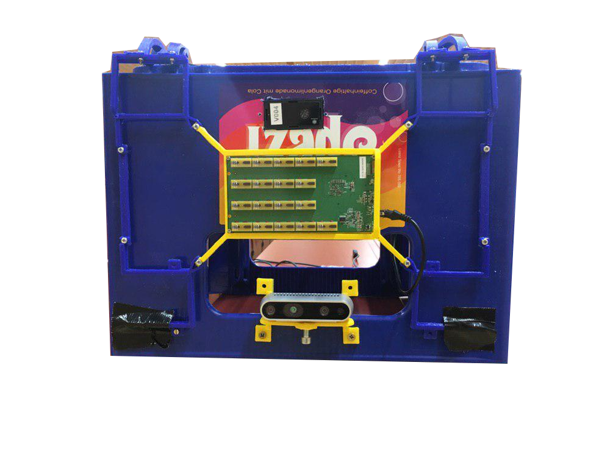
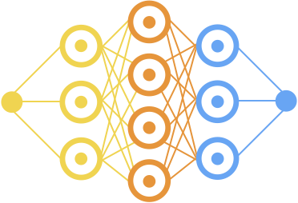

# Roboy Medium

<p align="center">
    
    
    
</p>


Estimating human poses is essential for most technical systems that operate in a shared environments with humans. 
Unlike vision based approaches, Radar signals travel through walls, and allow anonymous and light-weight detection of humans.

See our [medium article](https://github.com/Roboy/Medium.git) to learn more about our project.

This repository contains our code base for the Roboby Medium 24GHz project, with ros packages for human pose detection from Radar signals, and data pipeline as well as machine learning testbed for training and testing models for human pose estimation.
The code was developed and tested on systems running [Ubuntu 18.04](http://releases.ubuntu.com/18.04/) and [ROS melodic](http://wiki.ros.org/melodic), and is organized in three submodules, with more precises ReadMe documentation inside:
1. "medium-ros" contains all ros packages required for human pose estimation and more
1. "data-pipeline" contains scripts and instructions for recording, pre-processing, and supervising raw radar samples
1. "model-pipeline" contain [PyTorch](https://pytorch.org/) implementations of our localization models and training pipeline

## Getting Started

These instructions will get you a copy of the project up and running on your local machine for development and testing purposes.

### Dependencies

* [ROS melodic](http://wiki.ros.org/melodic)
* [Walabot API](https://api.walabot.com/_install.html) 
* [Toposens ROS-packages](https://github.com/toposens/ros) v1.0.0
* [PyTorch](https://pytorch.org/) v1.2.0
* [OpenPose](https://github.com/CMU-Perceptual-Computing-Lab/openpose) v1.5.1 and [docker image](https://hub.docker.com/r/cwaffles/openpose)

### Prerequisites

Please make sure that your system has installed the dependencies listed above. 
Alternatively, install missing dependencies
```
sudo apt install python-rosinstall python-rosinstall-generator python-wstool build-essential python-catkin-tools ros-melodic-rviz-visual-tools ros-melodic-toposens
```
and the required libraries into your desired python environment as follows:
```
cd /path/to/radar_pose_estimation/
pip install -r requirements.txt
```

### Installing

For installing the single submodules, please refer to the respective ReadMe documentation inside the sub-repositories.

### Questions

For questions and bug reports please open an issue in this repository or write a mail to [Christopher Lang](mailto:christopher.lang@tum.de), [Lennart Aigner](mailto:lennart.aigner@tum.de), or [Tamara Shnyrina](mailto:tamara.shnyrina@tum.de).

<div align="center">
    
</div>